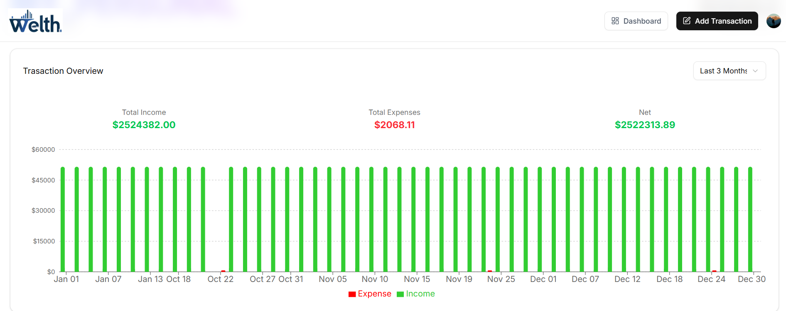
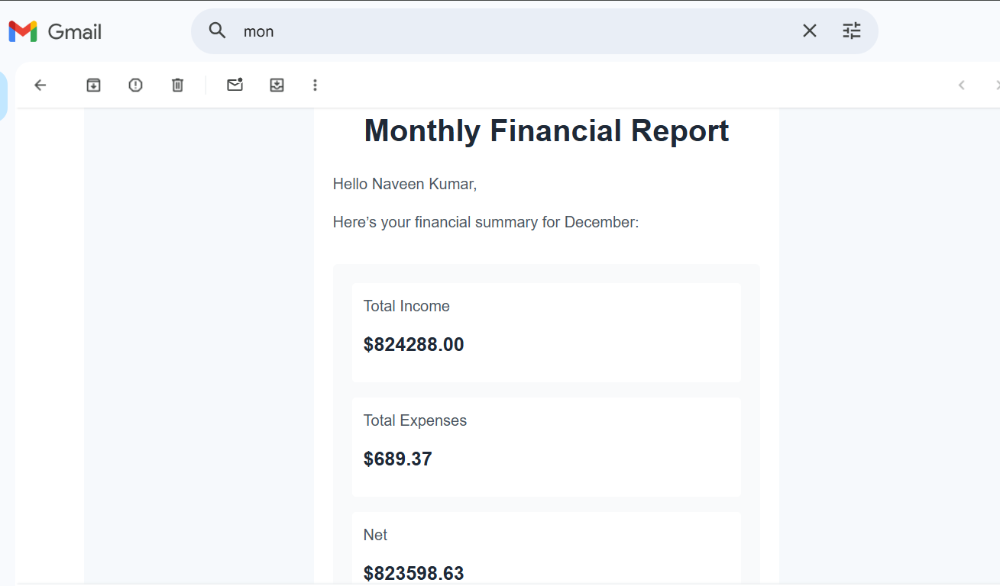

# AI-Wealth – Smart Finance Dashboard 💰🤖

AI-Wealth is an **AI-powered personal finance management platform** that helps users track income, expenses, budgets, and financial trends using intelligent automation and real-time analytics.

---  

## 🚀 Problem Statement

Managing personal finances manually is time-consuming, error-prone, and lacks actionable insights.  
Users often struggle with tracking recurring expenses, categorizing transactions, and maintaining budgets consistently.  
Traditional finance apps require heavy manual input and do not provide intelligent automation.

**AI-Wealth solves this problem** by automating transaction management, leveraging AI for receipt parsing, and providing visual insights to help users make smarter financial decisions.

---

## 🧠 Key Highlights

- AI-powered receipt scanning using Gemini AI  
- Automated recurring transactions with Inngest  
- Real-time financial analytics and reports  
- Secure authentication and cloud-based data storage  

---

## 🌐 Landing Page

The landing page introduces AI-Wealth and clearly communicates its purpose as an AI-powered personal finance management platform.

**Features:**
- Clean and modern UI highlighting AI-driven money management  
- Clear call-to-action buttons for onboarding and login  
- Concise description of features like expense tracking, budgeting, and analytics  
- Responsive design ensuring accessibility across devices  

The landing page is designed to quickly build trust and guide users toward managing their finances intelligently.

---

## 🔐 Authentication – Secure Login

**Features:**
- Secure Google OAuth login using Clerk  
- Prevents unauthorized access  
- Ensures user-specific financial data isolation  

---

## 📊 Dashboard Overview

**Features:**
- Displays monthly budget usage in real time  
- Shows total income, expenses, and net balance  
- Visual indicators for spending progress  

---

## 📈 Transaction Analytics

**Features:**
- Income vs expense comparison using charts  
- Time-range based filtering (monthly / quarterly)  
- Clear visual insights for better financial planning  

---

## 🧾 Transactions Management

**Features:**
- View all transactions in a searchable table  
- Filter by type (recurring / non-recurring)  
- Categorized transactions with color indicators  

---

## 🤖 AI Receipt Scanning

**Features:**
- Scan receipts using **Gemini AI**  
- Automatically extracts amount, category, and date  
- Reduces manual data entry by **90%+**  

---

## 📬 Monthly Email Reports

**Features:**
- Automated monthly financial summary emails  
- Includes total income, expenses, and net savings  
- Keeps users informed without opening the app  

---

## Problems Faced & Solutions

### 1. Incorrect Currency & Number Formatting

**Problem:**  
Some AI-scanned receipts returned amounts in different currencies or included commas and symbols, leading to calculation errors.

**Solution:**  
Added a preprocessing step to clean the input:
- Removed non-numeric characters using regex  
- Normalized values into a standard `xx.xx` format  
- Parsed the result into a float before storing in Supabase  

**Result:**  
All transaction amounts are now stored in a consistent and accurate format.

---

### 2. Missing Input Validations

**Problem:**  
Users could submit:
- Negative amounts  
- Empty categories  
- Text values (e.g., “two hundred”)  

This caused invalid data to be saved.

**Solution:**  
Implemented basic validations on input fields:

This caused invalid data to be saved.

if (amount <= 0) return error;

### 3. Handling Large Transaction Volumes
Manually managing 50+ daily transactions caused performance issues.  
**Solution:** Used pagination  and indexed transaction data efficiently.

---

## ⭐ Major Features

### 1. AI-Powered Receipt Parsing
**Why:** Eliminates manual expense entry  
**Tech:** Gemini AI, Next.js

### 2. Automated Recurring Transactions
**Why:** Saves time and ensures consistency  
**Tech:** Inngest, Supabase

### 3. Budget Tracking & Alerts
**Why:** Helps users stay within limits  
**Tech:** React 19, Chart Libraries

### 4. Email Notifications
**Why:** Passive financial awareness  
**Tech:** Inngest, Email Services

---

## 🧩 Technologies Used

- **Next.js** – Full-stack framework  
- **React 19** – Frontend UI  
- **Supabase** – Database & authentication support  
- **Clerk** – Secure authentication  
- **Gemini AI** – Receipt parsing  
- **Inngest** – Background jobs & automation  
- **Tailwind CSS** – Responsive UI styling  

---

## 🏗️ Architecture

- Server Components + Client Components  
- RESTful & Event-Driven APIs  
- Secure Auth-based Data Isolation  
- Background Job Processing (Inngest)

---

## 🔮 Future Enhancements

- AI-based spending recommendations  
- Multi-currency support  
- Investment tracking  
- Export financial reports (PDF/CSV)  
- Mobile-first optimization  

---

## 📩 Feedback / Contributions

📧 Email: naveenkumar6885268@gmail.com  
💼 LinkedIn: Your LinkedIn Profile  

---

## 📄 License

This project is built for educational and portfolio purposes and is not intended for commercial use.

---

  ❤️ Created with love by  
  <strong>Naveen Kumar</strong>  
  Full Stack Developer | MERN | AI | DSA

